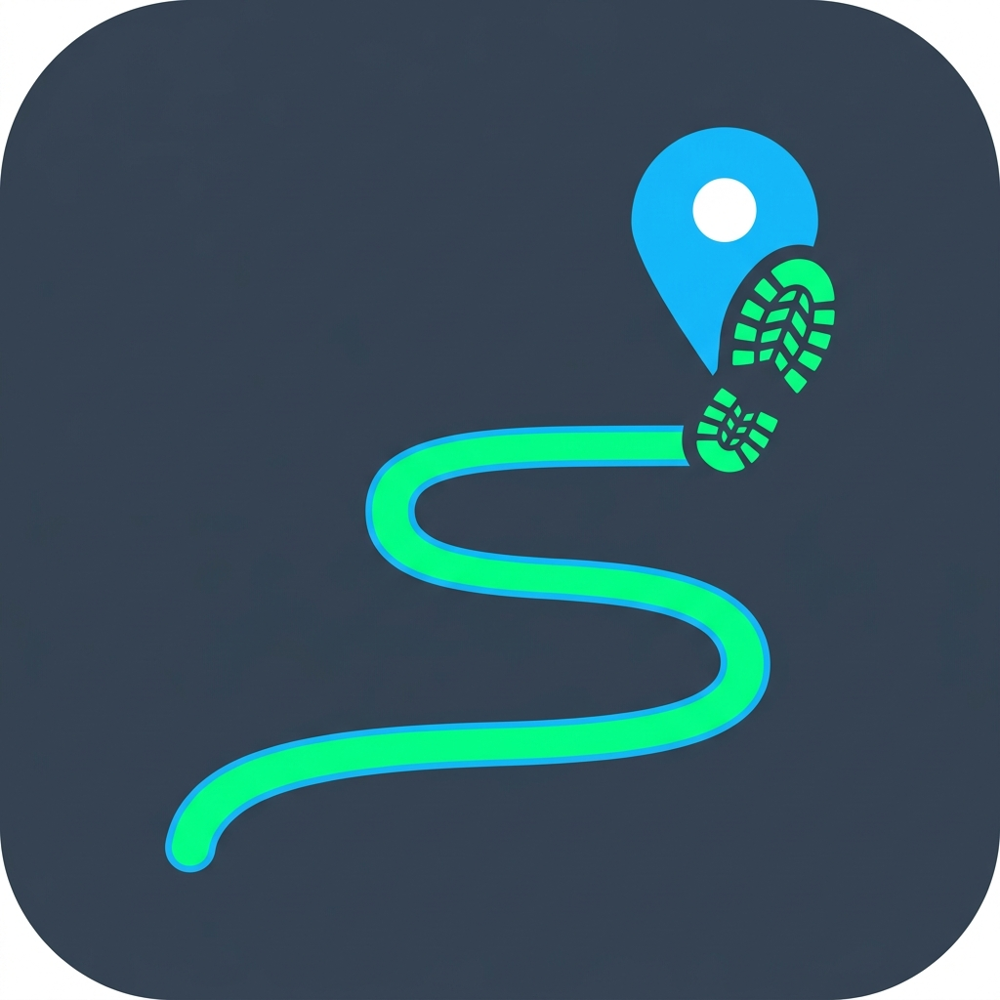
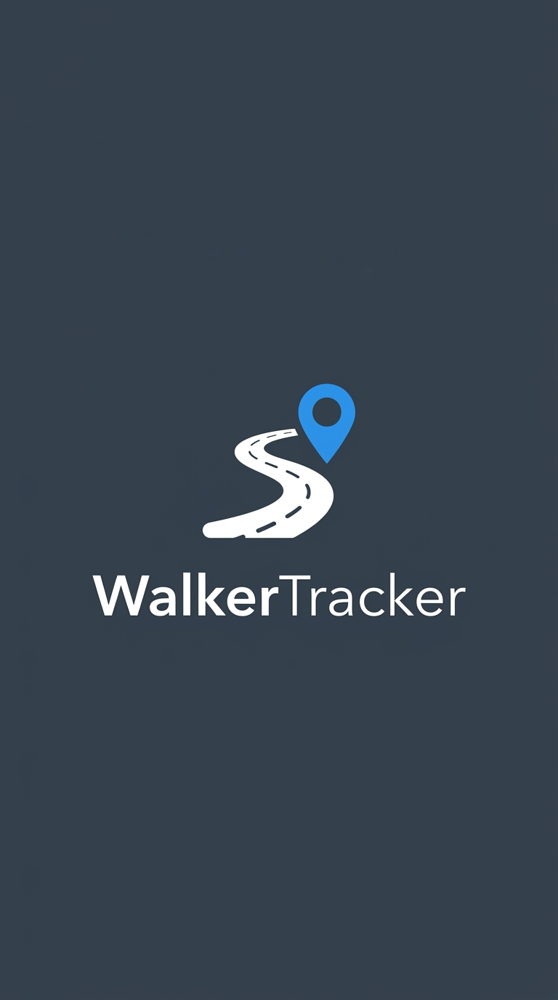
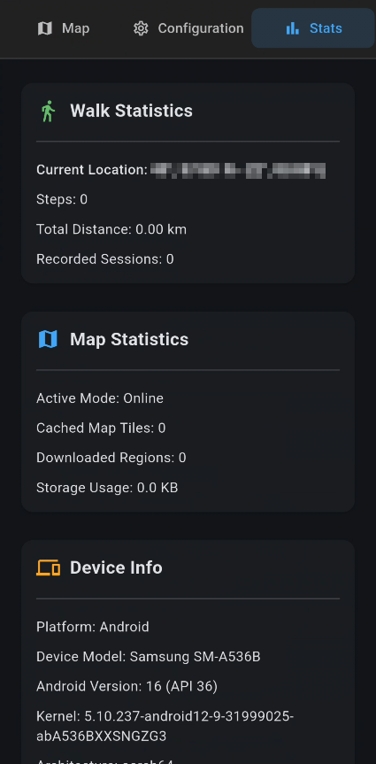
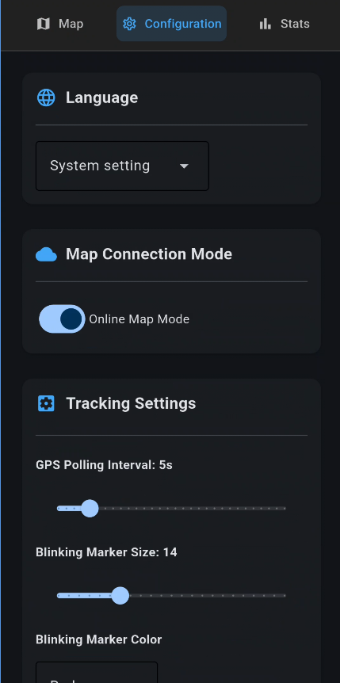

<p align="center">
  
</p>

# WalkerTracker 🚶‍♂️🧭

[](https://opensource.org/licenses/MIT)
[](https://www.python.org/downloads/)
[](https://flet.dev/)

**WalkerTracker** is a privacy-first, open-source walking recorder, step counter, and offline navigation assistant built with Python and Flet for Android and Desktop platforms.

* **Repository:** [https://github.com/Twilight0/org.walkertracker](https://github.com/Twilight0/org.walkertracker)
* **Privacy Policy:** Read our full [Privacy Policy](PRIVACY_POLICY.md).

---

## App Preview & Screenshots 📱

### App Icon & Splash Screen
<p align="center">
  
  &nbsp;&nbsp;&nbsp;&nbsp;&nbsp;&nbsp;&nbsp;&nbsp;
  
</p>

### Application Interface
<p align="center">
  
  &nbsp;&nbsp;&nbsp;&nbsp;
  
  &nbsp;&nbsp;&nbsp;&nbsp;
  
</p>

<p align="center">
  <b>Left:</b> Interactive Map & Live Tracking | <b>Center:</b> Live Statistics & Device Info | <b>Right:</b> App Settings & Map Downloader
</p>

---

## Key Features ✨

* 🗺️ **Online & Offline Navigation:** Interactive map viewer supporting online Google Maps / OpenStreetMap raster tiles, custom region downloads, and full local tile caching for off-grid hiking.
* 🧭 **Tilt-Compensated 3D Compass:** Combines accelerometer and magnetometer readings with exact 3D Euler tilt de-rotation so your direction arrow remains aligned with Google Maps even when holding your phone tilted at a viewing angle.
* 🌐 **100% Offline WMM2025 Declination:** Embedded NOAA World Magnetic Model 2025 algorithm automatically converts Magnetic North to **True Geographic North** anywhere on Earth without requiring an internet connection.
* 🚶 **Pedometer with Motion Filtering:** Real-time step counter featuring a peak-hysteresis algorithm and an adjustable sensitivity slider (`10.0`–`18.0 m/s²`) to filter out false step triggers from vehicle rides or hand motion.
* 📍 **Smart Location Override & DMM Format:** Supports manual location overrides accepting DMM (`40°, 40.40' N, 23°, 43.65' E`), Decimal (`40.6733, 23.7275`), and DMS formats.
* 📈 **RDP Path Smoothing:** Polyline trail recorder with a 3-point moving average pre-filter and Ramer-Douglas-Peucker finite segment distance projection to eliminate GPS zig-zags and high-frequency jitter.
* 📊 **Comprehensive Map & Walk Statistics:** Displays active connection mode (`Online` / `Offline`), total cached map tiles, packaged offline regions, total storage usage (KB/MB/GB), step history, and detailed Android device/kernel info (`/proc/version`).
* 🔒 **Privacy-First (Zero Telemetry):** All location coordinates, step counts, trails, and settings are processed and stored 100% locally on your device.
* 🌐 **Bilingual Support:** Full English (`en`) and Greek (`el`) localization.

---

## Project Structure 📁

```
org.walkertracker/
├── screens/             # UI screenshots (Main screen, Stats, Options)
├── src/
│   ├── main.py          # Main application logic, UI views, sensor fusion, & WMM2025 model
│   ├── tile_server.py   # Local HTTP tile server for offline maps
│   ├── downloader.py    # Tile downloader engine
│   ├── locales.py       # English and Greek translation dictionaries
│   └── assets/          # App icon and splash screen images
├── pyproject.toml       # Dependencies, app metadata, and build configuration
├── PRIVACY_POLICY.md    # Transparent open-source privacy policy
└── README.md            # Project documentation & build instructions
```

---

## Building & Running from Source 🛠️

### Prerequisites

* **Python:** 3.10 or higher installed.
* **Android SDK & NDK:** Required for building Android APK binaries.
* **ADB (Android Debug Bridge):** Required to deploy and launch builds on a physical device.

---

### Option 1: Building with `uv` (Recommended)

`uv` is the recommended fast package manager for Python projects.

#### 1. Run locally in Desktop mode
```bash
uv run flet run
```

#### 2. Run locally in Web mode
```bash
uv run flet run --web
```

#### 3. Build Android APK
Clean stale build caches and compile an ARM64 APK:
```bash
uv run flet clean && uv run flet build apk --split-per-abi --arch arm64-v8a
```
The compiled APK will be located at:
`build/apk/walkertracker-arm64-v8a.apk`

#### 4. Deploy and Launch on Android Device via ADB
```bash
# Connect ADB (over USB or Wireless ADB)
adb connect <DEVICE_IP>:<PORT>

# Stream install update
adb install -r build/apk/walkertracker-arm64-v8a.apk

# Force-stop and launch app
adb shell am force-stop org.walkertracker
adb shell monkey -p org.walkertracker -c android.intent.category.LAUNCHER 1
```

---

### Option 2: Building directly with Flet CLI

If you prefer using standard Python `pip` and global/venv `flet`:

#### 1. Setup Virtual Environment & Install Dependencies
```bash
python3 -m venv venv
source venv/bin/activate
pip install flet
```

#### 2. Run Desktop App
```bash
flet run
```

#### 3. Build Android APK
```bash
flet clean
flet build apk --split-per-abi --arch arm64-v8a
```

---

## Permissions Breakdown 🛡️

| Permission | Reason |
| :--- | :--- |
| `ACCESS_FINE_LOCATION` | Live GPS coordinate tracking, speed calculation, and map auto-centering |
| `ACCESS_BACKGROUND_LOCATION` | Continuous path and step logging while phone screen is off |
| `POST_NOTIFICATIONS` | Foreground service notification for background tracking |
| `BODY_SENSORS` | Accelerometer & Magnetometer reading for pedometer & 3D compass |
| `INTERNET` | Downloading online map tiles (Google Maps / OpenStreetMap) |
| `READ_EXTERNAL_STORAGE` | Storing local map tiles and offline region packages |

---

## License 📜

Distributed under the **MIT License**. See `PRIVACY_POLICY.md` for complete privacy details.
